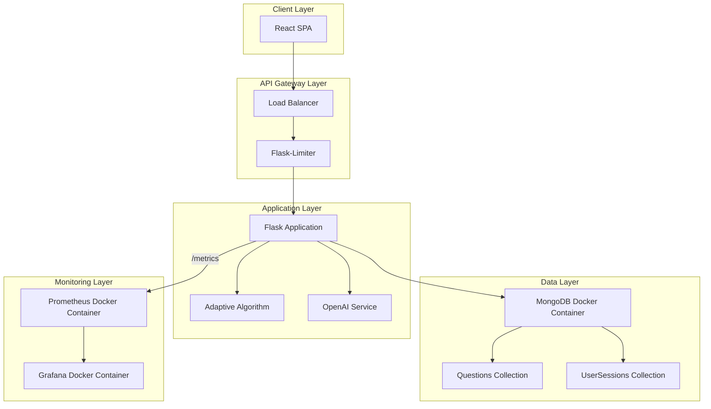
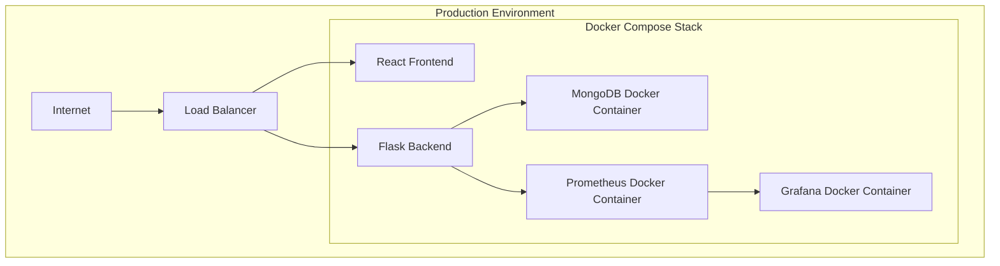

# Design Document: Adaptive Diagnostic Engine

## Overview

The Adaptive Diagnostic Engine is a GRE-style adaptive testing system that delivers personalized assessments and study recommendations. The system starts with baseline difficulty questions and dynamically adjusts difficulty based on user performance using IRT-inspired algorithms. After 10 questions, the system sends performance data to OpenAI to generate a personalized 3-step study plan. The architecture follows a microservices pattern with Flask backend, MongoDB for data persistence, React frontend, and comprehensive monitoring with Prometheus and Grafana.

## Architecture



## Components and Interfaces

### Component 1: Backend API (Flask)

**Purpose**: RESTful API layer handling HTTP requests, authentication, and routing

**Interface**:
```pascal
INTERFACE FlaskApp
  METHODS
    start_session(): POST /start-session
    next_question(): GET /next-question
    submit_answer(): POST /submit-answer
    get_result(): GET /result
    get_metrics(): GET /metrics
    
  AUTHENTICATION
    X-API-KEY header validation
    
  RATE_LIMITING
    requests per minute per API key
END INTERFACE
```

**Responsibilities**:
- Handle incoming HTTP requests
- Validate X-API-KEY authentication
- Apply rate limiting per API key
- Route requests to appropriate handlers
- Return JSON responses with proper status codes
- Log requests and errors

### Component 2: Adaptive Algorithm Engine

**Purpose**: Core logic for question selection and ability estimation

**Interface**:
```pascal
INTERFACE AdaptiveEngine
  METHODS
    get_next_question(user_session): Question
    update_ability(user_session, is_correct): VOID
    calculate_difficulty(current_ability, is_correct): FLOAT
    
  STATE
    current_ability: FLOAT (0.0 to 1.0)
    question_history: LIST[Question]
    correct_count: INTEGER
    incorrect_count: INTEGER
END INTERFACE
```

**Responsibilities**:
- Initialize ability score at 0.5 for new sessions
- Select next question based on current ability and difficulty
- Update ability score after each response using logistic model
- Track question history and performance metrics
- Calculate optimal difficulty for next question

### Component 3: OpenAI Integration Service

**Purpose**: Generate personalized study plans based on performance

**Interface**:
```pascal
INTERFACE OpenAIService
  METHODS
    generate_study_plan(performance_data): StudyPlan
    
  CONFIGURATION
    model: "gpt-4"
    temperature: 0.7
    max_tokens: 1000
END INTERFACE
```

**Responsibilities**:
- Format performance data for OpenAI prompt
- Send request to OpenAI API
- Parse and validate response
- Return structured study plan with 3 steps

### Component 4: MongoDB Data Layer

**Purpose**: Persistent storage for questions and user sessions (Docker-based MongoDB)

**Interface**:
```pascal
INTERFACE MongoDBRepository
  METHODS
    get_questions_by_difficulty_range(min_difficulty, max_difficulty): LIST[Question]
    get_question_by_id(question_id): Question
    create_user_session(session_data): UserSession
    get_user_session(session_id): UserSession
    update_user_session(session_id, update_data): UserSession
    seed_questions(questions): INTEGER
    initialize_database(): VOID
END INTERFACE
```

**Responsibilities**:
- Store and retrieve questions with difficulty, topic, and tags
- Create and manage user sessions
- Track question history and ability scores
- Support question seeding for initial data population
- Handle Docker-based MongoDB connection via connection pooling

**Docker Configuration**:
- Image: `mongo:6` (official MongoDB image)
- Container name: `mongo` (Docker Compose service name)
- Port: `27017:27017` (host:container mapping)
- Volume: `mongo-data:/data/db` for data persistence
- Connection URI: `mongodb://mongo:27017/adaptive_test`
- Environment variables for initialization (optional, for init scripts)
- Restart policy: `unless-stopped` for reliability

### Component 5: Monitoring and Metrics

**Purpose**: Collect and expose application metrics

**Interface**:
```pascal
INTERFACE MetricsCollector
  METHODS
    record_request_duration(endpoint, duration): VOID
    record_question_response(is_correct, difficulty): VOID
    record_openai_api_call(duration, success): VOID
    get_metrics(): STRING
    
  METRICS
    request_duration_seconds
    questions_answered_total
    questions_correct_total
    openai_api_calls_total
    openai_api_duration_seconds
END INTERFACE
```

**Responsibilities**:
- Track request durations per endpoint
- Record question response accuracy and difficulty
- Monitor OpenAI API call performance
- Expose metrics in Prometheus format

## Data Models

### Model 1: Question

```pascal
STRUCTURE Question
  id: UUID
  text: STRING
  options: LIST[STRING]
  correct_answer: INTEGER (0 to len(options)-1)
  difficulty: FLOAT (0.1 to 1.0)
  topic: STRING
  tags: LIST[STRING]
  created_at: TIMESTAMP
END STRUCTURE
```

**Validation Rules**:
- `difficulty` must be between 0.1 and 1.0
- `correct_answer` must be valid index for options array
- `topic` and `text` cannot be empty
- `options` must have at least 2 options

### Model 2: UserSession

```pascal
STRUCTURE UserSession
  session_id: UUID
  user_id: STRING
  start_time: TIMESTAMP
  current_ability: FLOAT (default 0.5)
  question_history: LIST[QuestionHistoryItem]
  correct_count: INTEGER (default 0)
  incorrect_count: INTEGER (default 0)
  questions_asked: INTEGER (default 0)
  study_plan: StudyPlan (optional)
  end_time: TIMESTAMP (optional)
END STRUCTURE

STRUCTURE QuestionHistoryItem
  question_id: UUID
  difficulty: FLOAT
  is_correct: BOOLEAN
  response_time_ms: INTEGER
  timestamp: TIMESTAMP
END STRUCTURE

STRUCTURE StudyPlan
  steps: LIST[StudyPlanStep]
  generated_at: TIMESTAMP
END STRUCTURE

STRUCTURE StudyPlanStep
  title: STRING
  description: STRING
  action_items: LIST[STRING]
END STRUCTURE
```

**Validation Rules**:
- `current_ability` must be between 0.0 and 1.0
- `questions_asked` must equal length of `question_history`
- `correct_count + incorrect_count` must equal `questions_asked`
- `study_plan` can only be set after 10 questions

### Model 3: APIKey

```pascal
STRUCTURE APIKey
  key: STRING (hashed)
  name: STRING
  permissions: LIST[STRING]
  created_at: TIMESTAMP
  active: BOOLEAN (default true)
END STRUCTURE
```

**Validation Rules**:
- `key` must be stored as hash (not plaintext)
- `permissions` must be non-empty list
- `name` cannot be empty

## Algorithmic Pseudocode

### Main Adaptive Algorithm

```pascal
ALGORITHM adaptive_diagnostic_engine
INPUT: user_request (type: Request)
OUTPUT: response (type: Response)

BEGIN
  // Step 1: Authenticate and rate limit
  IF NOT validate_api_key(user_request.headers.api_key) THEN
    RETURN error(401, "Invalid API key")
  END IF
  
  IF NOT rate_limit_check(user_request.headers.api_key) THEN
    RETURN error(429, "Rate limit exceeded")
  END IF
  
  // Step 2: Route to appropriate handler
  SWITCH user_request.method AND user_request.path DO
    CASE POST, /start-session:
      response ← handle_start_session(user_request)
      
    CASE GET, /next-question:
      response ← handle_next_question(user_request)
      
    CASE POST, /submit-answer:
      response ← handle_submit_answer(user_request)
      
    CASE GET, /result:
      response ← handle_get_result(user_request)
      
    CASE GET, /metrics:
      response ← handle_get_metrics(user_request)
      
    DEFAULT:
      response ← error(404, "Not found")
  END SWITCH
  
  RETURN response
END
```

**Preconditions:**
- API key is provided in request headers
- Rate limiter is initialized and running
- All handlers are properly registered

**Postconditions:**
- Response includes appropriate status code
- Metrics are recorded for each request
- Rate limit counters are updated

**Loop Invariants:** N/A (no loops in main algorithm)

### Question Selection Algorithm

```pascal
ALGORITHM select_next_question
INPUT: user_session (type: UserSession)
OUTPUT: question (type: Question)

BEGIN
  // Step 1: Calculate target difficulty based on current ability
  target_difficulty ← calculate_difficulty(user_session.current_ability, TRUE)
  
  // Step 2: Filter questions by difficulty range (±0.15)
  min_diff ← MAX(0.1, target_difficulty - 0.15)
  max_diff ← MIN(1.0, target_difficulty + 0.15)
  
  available_questions ← get_questions_by_difficulty_range(min_diff, max_diff)
  
  // Step 3: Exclude already-asked questions
  asked_ids ← EXTRACT id FROM user_session.question_history
  new_questions ← FILTER q IN available_questions WHERE q.id NOT IN asked_ids
  
  // Step 4: If not enough questions, expand difficulty range
  IF LENGTH(new_questions) < 3 THEN
    min_diff ← MAX(0.1, target_difficulty - 0.3)
    max_diff ← MIN(1.0, target_difficulty + 0.3)
    available_questions ← get_questions_by_difficulty_range(min_diff, max_diff)
    new_questions ← FILTER q IN available_questions WHERE q.id NOT IN asked_ids
  END IF
  
  // Step 5: Select random question from available pool
  IF LENGTH(new_questions) > 0 THEN
    question ← new_questions[RANDOM(0, LENGTH(new_questions)-1)]
  ELSE
    // Fallback: select any unasked question
    all_questions ← get_all_questions()
    unasked ← FILTER q IN all_questions WHERE q.id NOT IN asked_ids
    IF LENGTH(unasked) > 0 THEN
      question ← unasked[RANDOM(0, LENGTH(unasked)-1)]
    ELSE
      RETURN error("No more questions available")
    END IF
  END IF
  
  RETURN question
END
```

**Preconditions:**
- User session exists with valid question history
- Question database contains at least one unasked question

**Postconditions:**
- Returns a question with difficulty close to target
- Question has not been asked in current session
- If no questions match difficulty, returns any available question

**Loop Invariants:**
- All filtered questions have difficulty within acceptable range
- No asked questions are included in new_questions

### Ability Update Algorithm

```pascal
ALGORITHM update_ability_score
INPUT: current_ability (type: FLOAT)
       is_correct (type: BOOLEAN)
       question_difficulty (type: FLOAT)
OUTPUT: new_ability (type: FLOAT)

BEGIN
  // Step 1: Calculate probability of correct response
  // Using logistic model: P(correct) = 1 / (1 + exp(-(ability - difficulty)))
  difference ← current_ability - question_difficulty
  probability ← 1.0 / (1.0 + EXP(-difference))
  
  // Step 2: Update ability using learning rate
  // If correct: increase ability, if incorrect: decrease ability
  learning_rate ← 0.1
  
  IF is_correct THEN
    // Correct answer: increase ability
    adjustment ← learning_rate * (1.0 - probability)
  ELSE
    // Incorrect answer: decrease ability
    adjustment ← -learning_rate * probability
  END IF
  
  new_ability ← current_ability + adjustment
  
  // Step 3: Clamp ability to valid range [0.0, 1.0]
  new_ability ← MAX(0.0, MIN(1.0, new_ability))
  
  RETURN new_ability
END
```

**Preconditions:**
- `current_ability` is between 0.0 and 1.0
- `question_difficulty` is between 0.1 and 1.0
- `is_correct` is a boolean value

**Postconditions:**
- Returns new ability score between 0.0 and 1.0
- Correct answers increase ability
- Incorrect answers decrease ability
- Adjustment magnitude depends on confidence (probability)

**Loop Invariants:** N/A (no loops in algorithm)

### OpenAI Study Plan Generation

```pascal
ALGORITHM generate_study_plan
INPUT: performance_data (type: PerformanceData)
OUTPUT: study_plan (type: StudyPlan)

BEGIN
  // Step 1: Format performance data for prompt
  prompt ← format_openai_prompt(performance_data)
  
  // Step 2: Call OpenAI API
  response ← openai_api.call(
    model = "gpt-4",
    prompt = prompt,
    temperature = 0.7,
    max_tokens = 1000
  )
  
  // Step 3: Parse response
  study_plan ← parse_study_plan(response)
  
  // Step 4: Validate study plan structure
  IF NOT validate_study_plan(study_plan) THEN
    RETURN error("Invalid study plan format")
  END IF
  
  RETURN study_plan
END

FUNCTION format_openai_prompt(performance_data)
BEGIN
  RETURN CONCAT(
    "Generate a 3-step personalized study plan based on the following performance data:\n",
    "Topics missed: ", performance_data.topics_missed, "\n",
    "Difficulty reached: ", performance_data.max_difficulty, "\n",
    "Accuracy: ", performance_data.accuracy, "%\n",
    "Format: JSON with steps array containing title, description, and action_items."
  )
END FUNCTION
```

**Preconditions:**
- Performance data includes topics missed, max difficulty, and accuracy
- OpenAI API is accessible and configured

**Postconditions:**
- Returns valid study plan with 3 steps
- Each step has title, description, and action items

**Loop Invariants:** N/A (no loops in algorithm)

## Key Functions with Formal Specifications

### Function 1: start_session()

```pascal
FUNCTION start_session(api_key)
  INPUT: api_key (type: STRING)
  OUTPUT: session_response (type: SessionResponse)
  
  PRECONDITIONS:
    - api_key is a valid, non-empty string
    - API key exists in database and is active
    - Rate limit has not been exceeded for this key
    
  POSTCONDITIONS:
    - Returns SessionResponse with session_id
    - Creates new UserSession in database with ability = 0.5
    - Sets start_time to current timestamp
    - question_history is empty list
    - correct_count and incorrect_count are 0
    
  SIDE EFFECTS:
    - Creates new document in UserSessions collection
    - Increments session counter metric
```

### Function 2: next_question()

```pascal
FUNCTION next_question(session_id)
  INPUT: session_id (type: UUID)
  OUTPUT: question_response (type: QuestionResponse)
  
  PRECONDITIONS:
    - session_id exists in UserSessions collection
    - UserSession.questions_asked < 10 (before study plan generation)
    - Question database contains unasked questions
    
  POSTCONDITIONS:
    - Returns QuestionResponse with question details
    - Updates UserSession.question_history with new question
    - Increments UserSession.questions_asked
    - Records question selection metric
    
  LOOP INVARIANTS:
    - No question appears twice in question_history
    - Question difficulty is within acceptable range of current ability
```

### Function 3: submit_answer()

```pascal
FUNCTION submit_answer(session_id, question_id, answer_index)
  INPUT: session_id (type: UUID)
         question_id (type: UUID)
         answer_index (type: INTEGER)
  OUTPUT: submission_response (type: SubmissionResponse)
  
  PRECONDITIONS:
    - session_id exists in UserSessions collection
    - question_id exists in question_history for this session
    - answer_index is valid for the question's options
    
  POSTCONDITIONS:
    - Returns SubmissionResponse with is_correct boolean
    - Updates UserSession.current_ability using logistic model
    - Updates UserSession.question_history with response time
    - Increments correct_count or incorrect_count
    - Records question response metric
    
  LOOP INVARIANTS:
    - correct_count + incorrect_count = questions_asked
    - current_ability remains between 0.0 and 1.0
```

### Function 4: get_result()

```pascal
FUNCTION get_result(session_id)
  INPUT: session_id (type: UUID)
  OUTPUT: result_response (type: ResultResponse)
  
  PRECONDITIONS:
    - session_id exists in UserSessions collection
    - UserSession.questions_asked >= 10 (study plan generated)
    
  POSTCONDITIONS:
    - Returns ResultResponse with ability score and study_plan
    - study_plan contains 3 steps if questions_asked >= 10
    - Records result retrieval metric
    
  SIDE EFFECTS:
    - Sets end_time if not already set
```

## Example Usage

```pascal
SEQUENCE
  // Step 1: Start a new session
  request ← create_request(
    method = POST,
    path = "/start-session",
    headers = { "X-API-KEY": "valid_api_key" }
  )
  response ← send_request(request)
  
  session_id ← response.body.session_id
  
  // Step 2: Get first question
  request ← create_request(
    method = GET,
    path = "/next-question",
    headers = { "X-API-KEY": "valid_api_key" }
  )
  response ← send_request(request)
  
  question ← response.body.question
  question_id ← question.id
  
  // Step 3: Submit answer
  request ← create_request(
    method = POST,
    path = "/submit-answer",
    headers = { "X-API-KEY": "valid_api_key" },
    body = {
      question_id = question_id,
      answer_index = 2
    }
  )
  response ← send_request(request)
  
  is_correct ← response.body.is_correct
  
  // Step 4: Get next question (repeated until 10 questions)
  // ...
  
  // Step 5: Get final result with study plan
  request ← create_request(
    method = GET,
    path = "/result",
    headers = { "X-API-KEY": "valid_api_key" }
  )
  response ← send_request(request)
  
  final_ability ← response.body.ability
  study_plan ← response.body.study_plan
END SEQUENCE
```

## Correctness Properties

### Property 1: Ability Score Bounds
**Universal Quantification**: For all UserSessions, current_ability is always between 0.0 and 1.0

**Formal Statement**: ∀s ∈ UserSessions, 0.0 ≤ s.current_ability ≤ 1.0

**Test Strategy**: Property-based testing with random ability updates

### Property 2: Accuracy Count Consistency
**Universal Quantification**: For all UserSessions, correct_count + incorrect_count equals questions_asked

**Formal Statement**: ∀s ∈ UserSessions, s.correct_count + s.incorrect_count = s.questions_asked

**Test Strategy**: Property-based testing with random answer submissions

### Property 3: No Duplicate Questions
**Universal Quantification**: For all UserSessions, question_history contains no duplicate question_ids

**Formal Statement**: ∀s ∈ UserSessions, DISTINCT(s.question_history[].question_id) = LENGTH(s.question_history)

**Test Strategy**: Property-based testing with random question sequences

### Property 4: Difficulty Adjustment Direction
**Universal Quantification**: For all question responses, if is_correct then next difficulty > current difficulty (on average)

**Formal Statement**: ∀r ∈ UserSessions.question_history, r.is_correct = true → E[next_difficulty] > r.difficulty

**Test Strategy**: Property-based testing with multiple correct answers

### Property 5: Study Plan Generation Trigger
**Universal Quantification**: For all UserSessions, study_plan is null if questions_asked < 10, and non-null if questions_asked >= 10

**Formal Statement**: ∀s ∈ UserSessions, (s.questions_asked < 10 → s.study_plan = null) ∧ (s.questions_asked >= 10 → s.study_plan ≠ null)

**Test Strategy**: Example-based testing with 10-question sessions

## Error Handling

### Error Scenario 1: Invalid API Key

**Condition**: X-API-KEY header is missing, empty, or does not match any active key in database
**Response**: HTTP 401 Unauthorized with JSON body: { "error": "Invalid API key" }
**Recovery**: Client must provide valid API key or authenticate

### Error Scenario 2: Rate Limit Exceeded

**Condition**: Number of requests from API key exceeds configured limit per minute
**Response**: HTTP 429 Too Many Requests with JSON body: { "error": "Rate limit exceeded" }
**Recovery**: Client must wait until rate limit window resets

### Error Scenario 3: Session Not Found

**Condition**: session_id in request does not exist in UserSessions collection
**Response**: HTTP 404 Not Found with JSON body: { "error": "Session not found" }
**Recovery**: Client must start a new session

### Error Scenario 4: No More Questions

**Condition**: All available questions have been asked and no new questions exist in database
**Response**: HTTP 404 Not Found with JSON body: { "error": "No more questions available" }
**Recovery**: Admin must seed more questions into database

### Error Scenario 5: OpenAI API Failure

**Condition**: OpenAI API call fails due to network error, invalid API key, or service unavailable
**Response**: HTTP 503 Service Unavailable with JSON body: { "error": "Study plan generation failed" }
**Recovery**: System continues to function but study plan is not generated; retry later

### Error Scenario 6: Invalid Question Answer

**Condition**: answer_index is out of bounds for question options
**Response**: HTTP 400 Bad Request with JSON body: { "error": "Invalid answer index" }
**Recovery**: Client must provide valid answer index

## Testing Strategy

### Unit Testing Approach

**Backend API Tests**:
- Test all 5 endpoints with valid and invalid inputs
- Verify authentication rejection for invalid API keys
- Test rate limiting behavior
- Mock database and OpenAI service calls

**Adaptive Engine Tests**:
- Test ability update with various difficulty levels
- Verify ability bounds (0.0 to 1.0)
- Test question selection with different ability levels
- Verify no duplicate questions in session

**OpenAI Service Tests**:
- Test prompt formatting with sample performance data
- Mock OpenAI API response
- Test study plan parsing and validation

### Property-Based Testing Approach

**Property Test Library**: fast-check (Python)

**Property 1: Ability Score Bounds**
```python
def test_ability_bounds():
    property(
        for_all(
            ability=st.floats(0.0, 1.0),
            difficulty=st.floats(0.1, 1.0),
            is_correct=st.booleans()
        ),
        lambda a, d, c: 0.0 <= update_ability(a, c, d) <= 1.0
    )
```

**Property 2: Accuracy Count Consistency**
```python
def test_accuracy_consistency():
    session = create_session()
    property(
        for_all(
            answers=st.lists(st.tuples(st.booleans(), st.floats(0.1, 1.0)))
        ),
        lambda answers: all_answers_correct(session, answers) implies
                       session.correct_count + session.incorrect_count == session.questions_asked
    )
```

**Property 3: No Duplicate Questions**
```python
def test_no_duplicate_questions():
    session = create_session()
    property(
        for_all(
            questions=st.lists(question_strategy, unique_by=lambda q: q.id)
        ),
        lambda questions: add_questions_to_session(session, questions) implies
                         len(set(q.id for q in session.question_history)) == len(session.question_history)
    )
```

### Integration Testing Approach

**End-to-End Flow Tests**:
- Complete session from start to result
- Verify all metrics are recorded
- Test study plan generation after 10 questions
- Verify database state after session completion

**Database Integration Tests**:
- Seed questions and verify count
- Create session and verify document structure
- Update session and verify persistence
- Query questions by difficulty range

**API Integration Tests**:
- Test all endpoints with real authentication
- Verify rate limiting across multiple requests
- Test concurrent sessions from same API key

## Performance Considerations

### Response Time Targets
- `/start-session`: < 100ms
- `/next-question`: < 50ms
- `/submit-answer`: < 100ms
- `/result`: < 200ms (excluding OpenAI call)
- `/metrics`: < 50ms

### Scalability Considerations
- MongoDB connection pooling for concurrent sessions
- Redis caching for rate limiting counters
- Async OpenAI API calls to avoid blocking
- Horizontal scaling of Flask instances behind load balancer

### Optimization Strategies
- Index MongoDB collections on session_id, question_id, difficulty
- Cache frequently accessed questions
- Batch question queries for difficulty range filtering
- Connection pooling for database and external API calls

## Security Considerations

### Authentication
- X-API-KEY header validation against database
- API keys stored as bcrypt hashes (never plaintext)
- Key rotation support via inactive/active flag

### Rate Limiting
- Per-API key rate limiting (configurable, default 100 requests/minute)
- Sliding window algorithm for accurate limiting
- Graceful degradation with 429 responses

### Data Protection
- User session data isolated by API key
- No PII stored in sessions (user_id is opaque identifier)
- Database queries use parameterized statements to prevent injection

### API Security
- HTTPS required for all API calls
- API keys should be rotated periodically
- Rate limiting prevents abuse and DoS attacks

## Dependencies

### Backend Dependencies
- Flask: Web framework
- Flask-Limiter: Rate limiting
- PyMongo: MongoDB driver
- prometheus_client: Metrics collection
- python-dotenv: Environment configuration

### Frontend Dependencies
- React: UI framework
- Vite: Build tool
- Axios: HTTP client
- React Router: Navigation

### Infrastructure Dependencies
- MongoDB: Database (mongo:6 Docker image)
- Docker: Containerization
- Docker Compose: Orchestration
- Prometheus: Metrics collection (Docker container)
- Grafana: Dashboard (Docker container)

### External Services
- OpenAI API: Study plan generation
- Docker Hub: Container images

## Deployment Architecture



### Docker Compose Configuration

```pascal
STRUCTURE docker-compose
  SERVICES
    frontend:
      build: ./frontend
      ports: ["3000:3000"]
      depends_on: ["backend"]
      
    backend:
      build: ./backend
      ports: ["5000:5000"]
      environment:
        - MONGODB_URI=mongodb://mongo:27017/adaptive_test
        - OPENAI_API_KEY=${OPENAI_API_KEY}
        - API_KEYS=${API_KEYS}
      depends_on: ["mongo"]
      
    mongo:
      image: mongo:6
      ports: ["27017:27017"]
      volumes: ["mongo-data:/data/db"]
      restart: unless-stopped
      
    prometheus:
      image: prom/prometheus
      ports: ["9090:9090"]
      volumes: ["./prometheus/prometheus.yml:/etc/prometheus/prometheus.yml"]
      
    grafana:
      image: grafana/grafana
      ports: ["3001:3000"]
      volumes: ["grafana-data:/var/lib/grafana"]
      depends_on: ["prometheus"]
      
  VOLUMES
    mongo-data:
    grafana-data:
END STRUCTURE
```

### Deployment Steps

1. **Initial Setup**:
   - Clone repository
   - Copy `.env.example` to `.env` and configure values (including `OPENAI_API_KEY`)
   - Run `docker-compose up -d` to start all services
   - Verify MongoDB is running: `docker-compose ps`
   - Seed questions using `python seed_questions.py` (run inside backend container or directly)
   - Access frontend at `http://localhost:3000`

2. **Docker-Based MongoDB Details**:
   - MongoDB runs in a Docker container using official `mongo:6` image
   - Data persists in Docker volume `mongo-data` to survive container restarts
   - Connection string: `mongodb://mongodb:27017/adaptive_test`
   - Container name: `mongo` (referenced by service name in docker-compose)
   - Port mapping: `27017:27017` for local access if needed

3. **Daily Operations**:
   - Monitor Grafana dashboards for errors and performance
   - Review Prometheus metrics for anomalies
   - Rotate API keys periodically

4. **Scaling**:
   - Increase backend replicas for higher load
   - Add MongoDB shards for larger datasets
   - Configure load balancer for traffic distribution

5. **Maintenance**:
   - Backup MongoDB data regularly using Docker volume backup
   - Update container images periodically: `docker-compose pull`
   - Review and rotate API keys